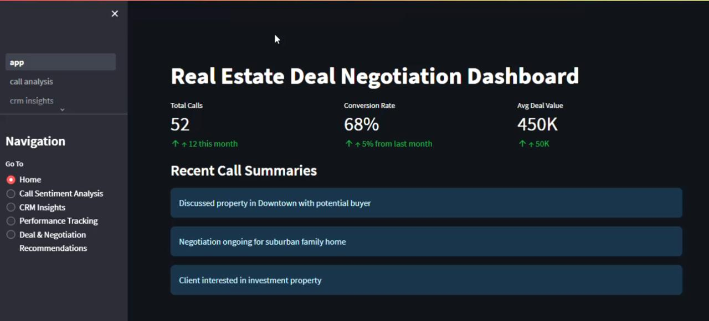
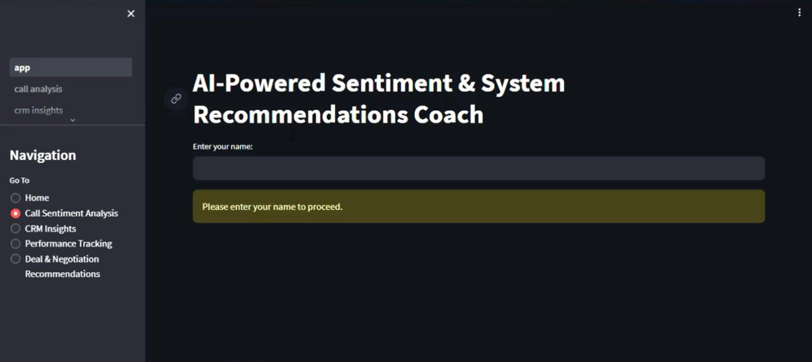
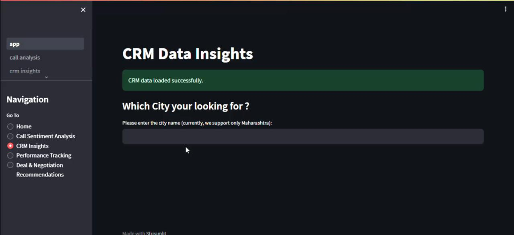
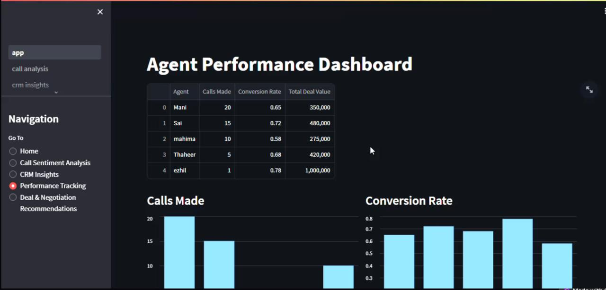
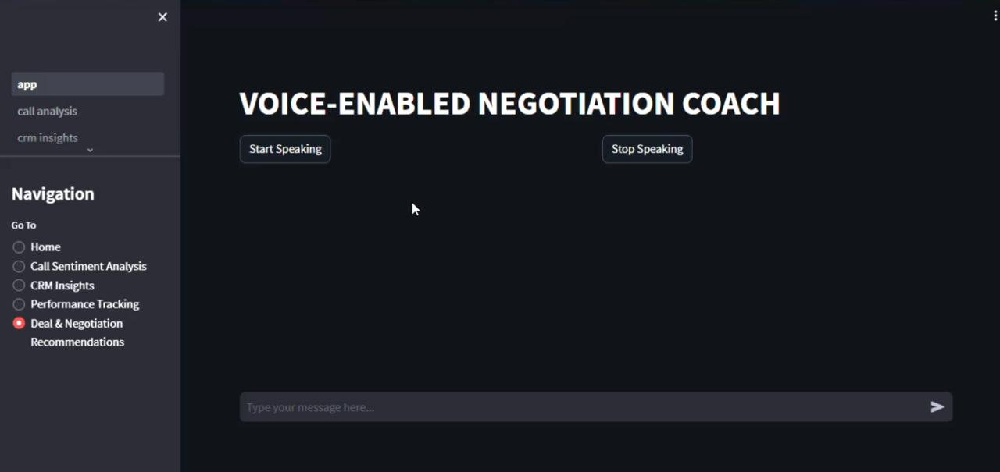
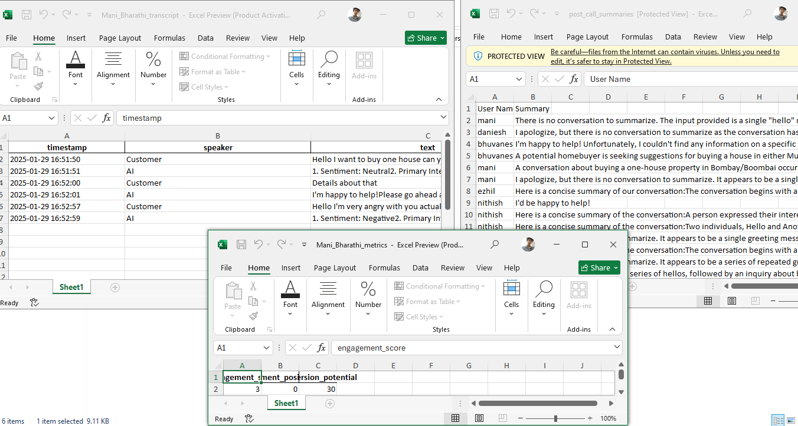

# Real Estate AI Negotiation Assistant

A sophisticated AI-powered system that combines real-time speech recognition with intelligent chatbot capabilities for real estate negotiations. The system processes live conversations, provides instant responses, and analyzes conversation metrics for better customer engagement.

## Output Screenshots

Here are some screenshots of the AI assistant in action:

### **1️⃣ Dashboard**


### **2️⃣ Live Speech Recognition & Sentiment Analysis Results**


### **3️⃣ Customer Engagement Metrics**


### **4️⃣ Performance Tracking**


### **5️⃣ Deal & negotiation Speech Recognition**


### **5️⃣ Post Call Summaries**


## Features
### Speech Recognition and Processing
- Real-time speech-to-text conversion
- Continuous conversation monitoring
- Natural language processing for intent recognition
- Sentiment analysis of customer interactions

### AI Chatbot Capabilities
- Context-aware responses using LangChain and Groq
- Document-based knowledge retrieval
- Conversation history maintenance
- Real-time response generation

### Analytics and Visualization
- Customer sentiment tracking
- Engagement score calculation
- Conversion potential analysis
- Interactive visualizations using Plotly

## Prerequisites

### Required Python Version
- Python 3.11 or higher

### API Keys
You'll need the following API keys:
- Groq API key
- Wit API Key

## Setup Instructions

1. Clone the repository:
```bash
git clone https://github.com/manibharathi19/Real-Time-AI-Sales-Intelligence-and-Sentiment-Driven-Deal-Negotiation-Assistant
cd real-estate-ai-assistant
```

2. Create a `.env` file in the project root with your API keys:
```env
GROQ_API_KEY=your_groq_key
Wit_API = your_Wit_key
```

3. Install dependencies:
```bash
pip install -r requirements.txt
```

## Running the Application

1. Start the main application:
```bash
streamlit run app.py
```

2. Enter your name in the interface when prompted.

3. Use the "Start Conversation" button to begin real-time speech recognition and AI response generation.

4. Use the "End Conversation" button to stop the session and view analytics.

## Features Details

### Speech Recognition
- Continuous monitoring of audio input
- Real-time transcription
- Timestamp tracking for each conversation segment

### AI Chatbot
- Document-based knowledge retrieval
- Context-aware responses
- Conversation history maintenance
- Natural language understanding

### Analytics
- Sentiment Analysis
  - Positive/Neutral/Negative classification
  - Sentiment trend tracking
- Intent Recognition
  - Purchase Inquiry
  - Price Negotiation
  - Location Preference
  - General Inquiry
- Performance Metrics
  - Engagement Score
  - Sentiment Positivity
  - Conversion Potential

## Data Storage

Conversation data is stored in the following format:
- Transcripts: Excel files with timestamp, speaker, text, sentiment, and intent
- Metrics: Excel files with performance analytics
- Summaries: Text files with post-call summaries

Default storage location: `Customers_Transcribe/`

## Customization

### Modifying the AI Model
You can change the AI model in `deal.py`:
```python
llm = ChatGroq(
    model_name="your-preferred-model",
    api_key=os.getenv("GROQ_API_KEY"),
    temperature=0.7
)
```

### Adjusting Analytics Parameters
Modify the scoring weights in `call_analysis.py`:
```python
intent_conversion_weights = {
    'Purchase Inquiry': 0.7,
    'Price Negotiation': 0.5,
    'Location Preference': 0.3,
    'General Inquiry': 0.2
}
```

## Troubleshooting

### Common Issues

1. Speech Recognition Not Working
   - Check microphone permissions
   - Verify audio input device selection
   - Ensure proper audio driver installation

2. AI Response Delays
   - Check internet connection
   - Verify API key validity
   - Monitor API rate limits

3. Data Storage Errors
   - Verify write permissions in the storage directory
   - Check available disk space
   - Ensure proper file path configuration

## License

This project is licensed under the MIT License - see the LICENSE file for details

## Acknowledgments

- Anthropic's Claude for AI assistance
- Streamlit for the web interface
- LangChain for the AI framework
- Groq for the language model
- Pinecone for vector storage

## Support

For support, please open an issue in the repository or contact Me
